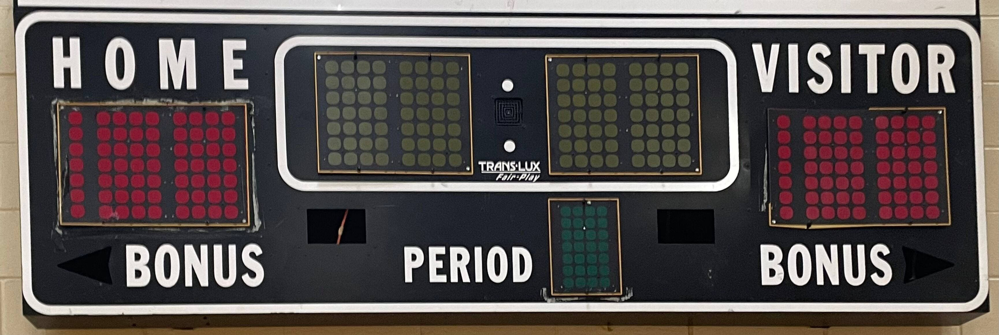
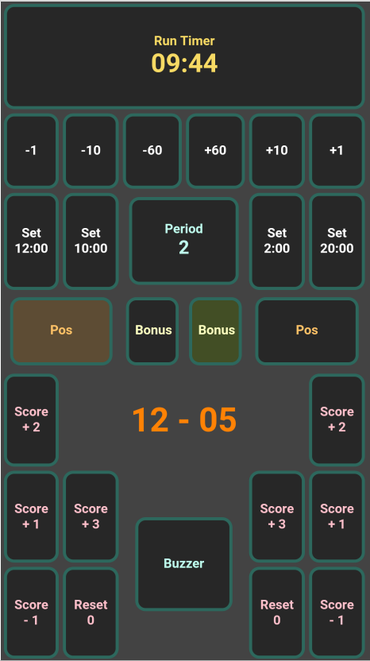

# ESP32 & FASTLED Wireless Scoreboard
### 1980s Basketball Scoreboard Functional Restoration
    
Scoreboard appears as a WiFi Access Point. Display panels are lit using WS2812b addressable LEDs. 

    
### Updated with ESP32 & LEDs    

## Mobile Control Panel:
Control page hosted at http://scoreboard.local
    

## Commands:
- /HomeScore?set={value}
- /HomeScore?change={amount}
- /VisitorScore?set={value}
- /VisitorScore?change={amount}
- /Time?set={valueInMinutes}
- /Time?change={amountInSeconds}
- /StartStopTimer
- /PeriodChange
- /HomeBonus
- /VisitorBonus
- /HomePos
- /VisitorPos
- /Buzzer