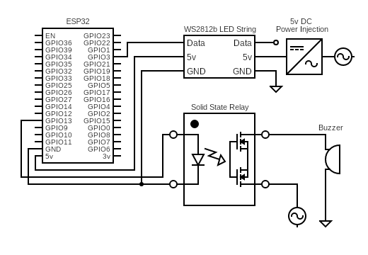
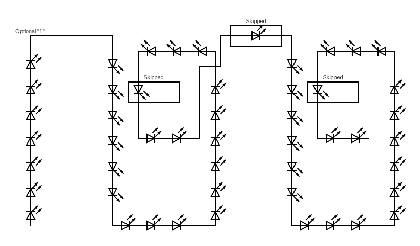

# ESP32 & FASTLED Wireless Scoreboard

### 1980s Basketball Scoreboard Functional Restoration
Scoreboard appears as a WiFi Access Point. Display panels are lit using WS2812b addressable LEDs. 

   

### Updated with ESP32 & LEDs    

## Mobile Control Panel:
Control page hosted at http://scoreboard.local

Design inspired by the control console described in the [Service Manual](SimilarScoreboardOriginalManual.pdf) of a similar scoreboard found archived online somewhere.

## Commands:
* http://scoreboard.local/HomeScore?set={integer}
  * Sets Home Score to the value provided
  * Sending `0` 6 consecutive times (with the timer not running) will enter "maintenance mode," where all relevant LEDs are lit
  * Sending `0` 7 consecutive times will force enter "sleep mode"
* http://scoreboard.local/HomeScore?change={integer}
  * Increases or decreases Home Score by the value provided
* http://scoreboard.local/VisitorScore?set={integer}
  * Sets Visitor Score to the value provided
* http://scoreboard.local/VisitorScore?change={integer}
  * Increases or decreases Visitor Score by the value provided
* http://scoreboard.local/Time?set={integer}
  * Sets Timer to the value provided in minutes
* http://scoreboard.local/Time?change={integer}
  * Adds or subtracts the provided number of seconds to the timer
* http://scoreboard.local/StartStopTimer
  * Toggles the running state of the timer
* http://scoreboard.local/PeriodChange
  * Increases the period by one, looping back to `1` after reaching `6`
* http://scoreboard.local/HomeBonus
  * Toggles the state of Home Bonus
* http://scoreboard.local/VisitorBonus
  * Toggles the state of Visitor Bonus
* http://scoreboard.local/HomePos
  * Sets Home Possession indicator on; Visitor Possesion indicator off
* http://scoreboard.local/VisitorPos
  * Sets Visitor Possession indicator on; Home Possesion indicator off
* http://scoreboard.local/Buzzer
  * Manually triggers the buzzer

## Materials:
- [ESP32 (30Pin)](https://a.co/d/d86ifeU)
- [ESP32 Breakout Board](https://a.co/d/4L5r7AB)
- [WS2812b LED String](https://a.co/d/gDH9oeh)
- [LED Connectors](https://a.co/d/a1vO4zF)
- [Extension Cable](https://a.co/d/eUv22nI)
- [Solid State Relay](https://a.co/d/gWr1grI)

## Diagram:

## Digit Element LED Configuration:
